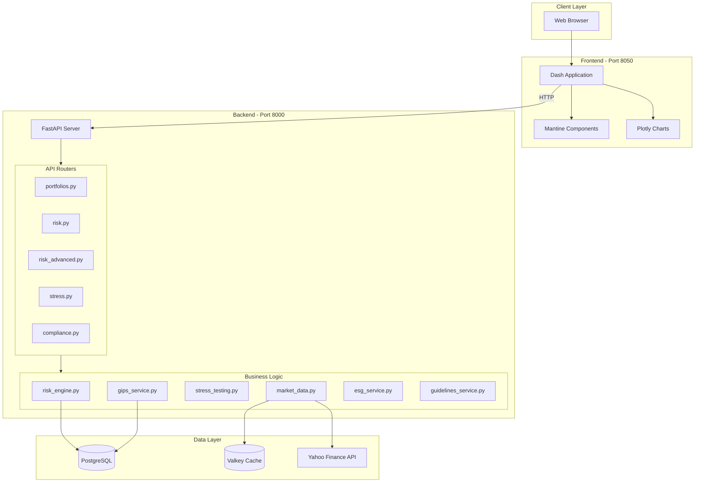
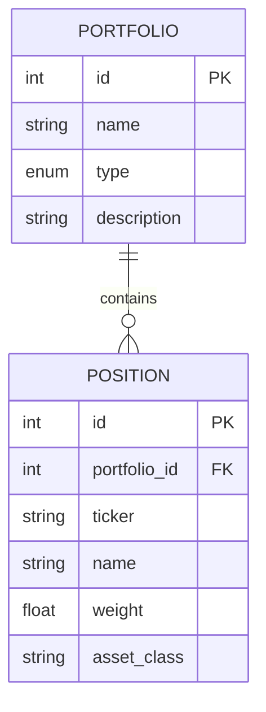
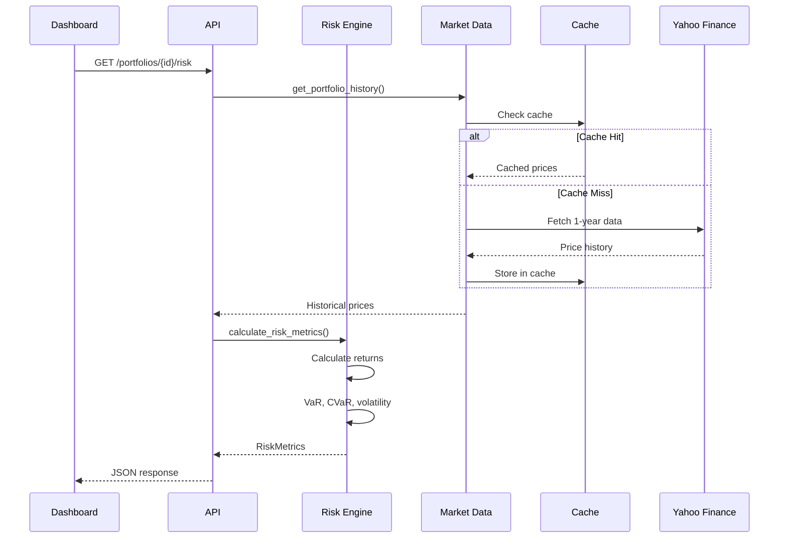
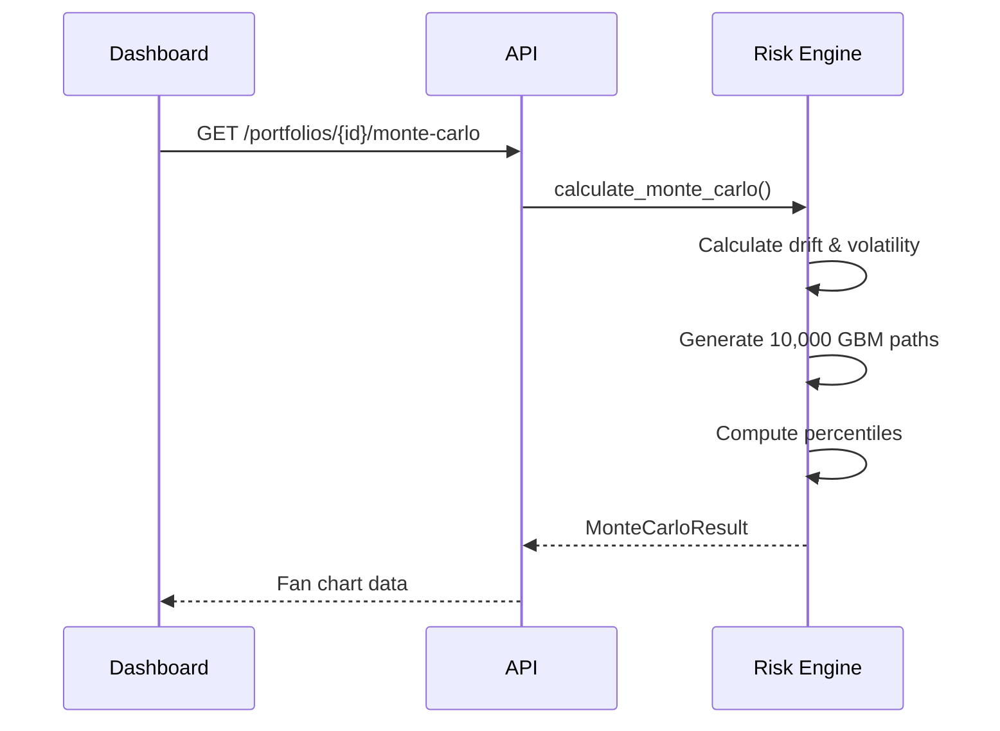
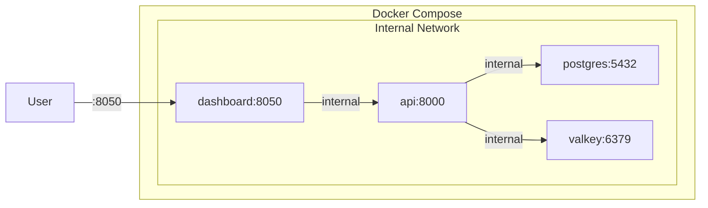

# Architecture

Technical architecture and system design of CerberusRisk.

---

## System Overview



---

## Component Details

### Frontend (Dashboard)

| Component | Technology | Purpose |
|-----------|------------|---------|
| Framework | Dash 2.18+ | Interactive web application |
| UI Library | Dash Mantine Components | Material Design components |
| Charts | Plotly 5.24+ | Interactive visualizations |
| Server | Gunicorn | Production WSGI server |

**Pages**:
- `home.py` - Executive dashboard with KPIs
- `analytics.py` - 7-tab portfolio analysis
- `docs.py` - Documentation viewer

---

### Backend (API)

| Component | Technology | Purpose |
|-----------|------------|---------|
| Framework | FastAPI 0.115+ | High-performance REST API |
| ORM | SQLAlchemy 2.0+ | Database abstraction |
| Validation | Pydantic | Request/response schemas |
| Math | NumPy, SciPy | Numerical computations |

**Routers**:
| Router | Endpoints | Responsibility |
|--------|-----------|----------------|
| portfolios.py | 5 | CRUD, valuations, data info |
| risk.py | 3 | Core risk metrics |
| risk_advanced.py | 10 | Advanced analytics |
| stress.py | 3 | Scenario analysis |
| compliance.py | 4 | GIPS, ESG, guidelines |

---

### Data Layer

#### PostgreSQL

Stores portfolio and position data.



#### Valkey Cache

High-performance caching for market data.

| Key Pattern | TTL | Data |
|-------------|-----|------|
| `quote:{ticker}` | 15 min | Live price, change |
| `history:{ticker}` | 24 hours | 1-year price history |
| `sector:{ticker}` | 7 days | Sector classification |

---

## Data Flow Patterns

### Risk Calculation Flow



### Monte Carlo Flow



---

## Service Layer

### Risk Engine (847 LOC)

Core quantitative module handling all risk calculations.

**Key Methods**:
```
calculate_returns()          → Log returns from prices
calculate_risk_metrics()     → VaR, CVaR, volatility, Sharpe
calculate_risk_contributions()→ Component VaR by position
calculate_correlation_matrix()→ Position correlations
calculate_rolling_metrics()  → 20-day rolling windows
calculate_tail_risk()        → Skewness, kurtosis
calculate_beta()             → Beta, alpha, R-squared
backtest_var()               → VaR breach analysis
calculate_monte_carlo()      → 10k path simulation
calculate_factor_exposures() → Multi-factor regression
```

### Market Data Service (329 LOC)

Handles price fetching and caching.

**Key Methods**:
```
get_quote()           → Live price with cache
get_history()         → 1-year price history
get_portfolio_quotes()→ Batch quote fetching
get_sector_info()     → Sector classification
refresh_cache()       → Force cache invalidation
```

---

## Deployment Architecture



### Container Configuration

| Service | Image | Ports | Health Check |
|---------|-------|-------|--------------|
| postgres | postgres:16-alpine | 5432 | pg_isready |
| valkey | valkey/valkey:8-alpine | 6379 | valkey-cli ping |
| api | python:3.12-slim | 8000 | - |
| dashboard | python:3.12-slim | 8050 | - |

---

## Security

### Middleware

- **CORS**: Configurable origins via environment
- **Security Headers**:
  - X-Content-Type-Options: nosniff
  - X-Frame-Options: DENY
  - Content-Security-Policy: default-src 'self'

### Production Mode

- API documentation disabled
- Debug mode off
- Environment-based configuration
