# Compliance

Investment compliance monitoring including GIPS performance standards, ESG scoring, and investment guidelines.

---

## GIPS Performance Standards

The Global Investment Performance Standards (GIPS) provide a standardized framework for calculating and presenting investment performance.

### Time-Weighted Returns (TWR)

CerberusRisk calculates returns using the time-weighted method, which eliminates the impact of external cash flows.

**Monthly Period Returns**:
| Metric | Description |
|--------|-------------|
| Gross Return | Return before fees |
| Net Return | Return after management fees (0.5% annually) |
| Benchmark Return | Comparison index return |

### Annualization

Returns are annualized using geometric compounding:

**Formula**: (1 + Total Return)^(12/months) - 1

### Composite Statistics

| Metric | Description |
|--------|-------------|
| Dispersion | Standard deviation of returns within composite |
| Number of Portfolios | Count of portfolios in composite |
| Total Assets | Sum of all portfolio values |

### Calendar Year Returns

Performance broken down by calendar year for historical comparison.

---

## ESG Scoring

Environmental, Social, and Governance analysis for responsible investing.

### Score Components

| Pillar | Factors Considered |
|--------|-------------------|
| **Environmental** | Carbon emissions, energy efficiency, waste management |
| **Social** | Labor practices, community impact, product safety |
| **Governance** | Board independence, executive compensation, shareholder rights |

### Score Scale

| Score Range | Rating | Description |
|-------------|--------|-------------|
| 80-100 | Leader | Industry-leading ESG practices |
| 60-79 | Average | Meets industry standards |
| 40-59 | Laggard | Below average, improvement needed |
| 0-39 | Poor | Significant ESG risks |

### Carbon Intensity

Weighted Average Carbon Intensity (WACI) measures portfolio carbon exposure.

**Formula**: WACI = Σ (Position Weight × Company Carbon Intensity)

| Level | Tonnes CO2/$M Revenue | Classification |
|-------|----------------------|----------------|
| Low | < 100 | Climate-friendly |
| Medium | 100-300 | Average exposure |
| High | > 300 | High carbon risk |

### Controversy Monitoring

Flags companies involved in ESG-related controversies:
- Environmental incidents
- Labor disputes
- Governance failures
- Product recalls

### Rating Distribution

Shows portfolio breakdown by ESG rating tier:

| Rating | Description |
|--------|-------------|
| AAA | Best in class |
| AA | Leader |
| A | Above average |
| BBB | Average |
| BB | Below average |
| B | Laggard |
| CCC | Poor |

---

## Investment Guidelines

Automated monitoring of portfolio compliance with investment policy constraints.

### Position Limits

Controls concentration in individual securities.

| Guideline | Conservative | Moderate | Aggressive |
|-----------|-------------|----------|------------|
| Single Position Max | 8% | 10% | 12% |

**Status Colors**:
- 🟢 **Green**: Within limit
- 🟡 **Yellow**: Warning (>80% of limit)
- 🔴 **Red**: Breach

---

### Sector Concentration

Limits exposure to any single sector.

| Guideline | Conservative | Moderate | Aggressive |
|-----------|-------------|----------|------------|
| Sector Max | 20% | 25% | 30% |

---

### Asset Class Ranges

Ensures proper diversification across asset classes.

| Asset Class | Minimum | Maximum |
|-------------|---------|---------|
| Equity | 40% | 80% |
| Fixed Income | 15% | 50% |
| Alternatives | 0% | 15% |
| Cash | 2% | 10% |

---

### Liquidity Requirements

Ensures portfolio can be liquidated in reasonable timeframe.

| Metric | Requirement |
|--------|-------------|
| Minimum Liquidity Score | 95 |
| Max Days to Liquidate | 5 |

---

### Compliance Dashboard

```mermaid
flowchart TD
    subgraph Guidelines
        G1[Position Limits]
        G2[Sector Caps]
        G3[Asset Ranges]
        G4[Liquidity]
    end

    G1 --> Check{Compliance<br/>Engine}
    G2 --> Check
    G3 --> Check
    G4 --> Check

    Check -->|All Pass| Green[🟢 Compliant]
    Check -->|Warning| Yellow[🟡 Warning]
    Check -->|Breach| Red[🔴 Breach]
```

### Status Definitions

| Status | Meaning | Action Required |
|--------|---------|-----------------|
| **Compliant** | All guidelines met | None |
| **Warning** | Approaching limits | Monitor closely |
| **Breach** | Guideline violated | Immediate review |

---

## Compliance Workflow

```mermaid
sequenceDiagram
    participant PM as Portfolio Manager
    participant Sys as CerberusRisk
    participant CO as Compliance Officer

    PM->>Sys: View Portfolio
    Sys->>Sys: Check Guidelines

    alt All Compliant
        Sys-->>PM: 🟢 Green Status
    else Warning
        Sys-->>PM: 🟡 Yellow Status
        PM->>PM: Review positions
    else Breach
        Sys-->>PM: 🔴 Red Status
        Sys->>CO: Alert notification
        CO->>PM: Request remediation
        PM->>Sys: Rebalance portfolio
    end
```

---

## Report Generation

CerberusRisk provides compliance reports including:

1. **GIPS Performance Report** - Standardized returns presentation
2. **ESG Scorecard** - Pillar scores and carbon metrics
3. **Guideline Status** - Real-time compliance monitoring
4. **Breach History** - Historical guideline violations
