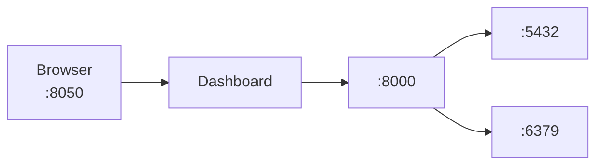

# Getting Started

Quick start guide for running CerberusRisk locally.

---

## Prerequisites

- **Podman** (or Docker) with Compose
- **Make** installed
- **8GB RAM** minimum (for smooth operation)
- **Ports available**: 8050 (Dashboard), 5432 (PostgreSQL), 6379 (Valkey)

---

## Quick Start

### 1. Clone the Repository

```bash
git clone https://github.com/bfozone/cerberusrisk.git
cd cerberusrisk
```

### 2. Start Services

```bash
make up
```

This starts all services:
- **PostgreSQL** - Database (port 5432)
- **Valkey** - Cache (port 6379)
- **API** - Backend (internal)
- **Dashboard** - Frontend (port 8050)

### 3. Access the Dashboard

Open your browser to: **http://localhost:8050**

---

## Architecture



---

## Make Commands

| Command | Description |
|---------|-------------|
| `make up` | Start all services |
| `make down` | Stop all services |
| `make dev` | Start with force recreate (development) |
| `make prod` | Start production mode (no overrides) |
| `make build` | Build and restart containers |
| `make rebuild` | Full rebuild without cache |
| `make logs` | Follow all logs |
| `make logs-api` | Follow API logs only |
| `make logs-dash` | Follow Dashboard logs only |
| `make ps` | Show container status |
| `make clean` | Stop, remove volumes, prune images |
| `make test` | Test API health and endpoints |
| `make shell-api` | Shell into API container |
| `make shell-db` | PostgreSQL interactive shell |

---

## Environment Variables

Configuration is managed via environment variables in `compose.yml`:

| Variable | Default | Description |
|----------|---------|-------------|
| `POSTGRES_HOST` | postgres | Database host |
| `POSTGRES_PORT` | 5432 | Database port |
| `POSTGRES_DB` | cerberusrisk | Database name |
| `POSTGRES_USER` | cerberus | Database user |
| `POSTGRES_PASSWORD` | *** | Database password |
| `VALKEY_HOST` | valkey | Cache host |
| `VALKEY_PORT` | 6379 | Cache port |
| `API_URL` | http://api:8000 | Backend URL (internal) |
| `DEBUG` | true | Debug mode |

---

## Development Mode

Development mode is enabled by default with `make up` or `make dev`:

- **API**: Auto-reload on code changes
- **Dashboard**: Auto-reload on code changes
- **Volume mounts**: Local code synced to containers

For production mode (no hot-reload):

```bash
make prod
```

---

## Sample Data

On first startup, the database is seeded with three sample portfolios:

### Global Equity Portfolio
| Ticker | Name | Weight |
|--------|------|--------|
| AAPL | Apple Inc | 15% |
| MSFT | Microsoft Corp | 12% |
| NVDA | NVIDIA Corp | 10% |
| AMZN | Amazon.com | 10% |
| JPM | JPMorgan Chase | 8% |
| JNJ | Johnson & Johnson | 8% |
| NESN | Nestlé | 7% |
| ASML | ASML Holding | 7% |
| NOVO | Novo Nordisk | 6% |
| MC | LVMH | 5% |
| CASH | Cash | 12% |

### Fixed Income Portfolio
| Ticker | Name | Weight |
|--------|------|--------|
| TLT | 20+ Year Treasury | 30% |
| IEF | 7-10 Year Treasury | 25% |
| LQD | Investment Grade Corp | 25% |
| HYG | High Yield Corp | 15% |
| AGG | Aggregate Bond | 5% |

### Multi-Asset Balanced
| Ticker | Name | Weight |
|--------|------|--------|
| SPY | S&P 500 | 35% |
| VGK | Europe ETF | 15% |
| VWO | Emerging Markets | 10% |
| TLT | Long Treasury | 20% |
| LQD | Corp Bonds | 10% |
| GLD | Gold | 5% |
| CASH | Cash | 5% |

---

## Common Tasks

### View Logs

```bash
make logs        # All services
make logs-api    # API only
make logs-dash   # Dashboard only
```

### Check Status

```bash
make ps
```

### Restart Services

```bash
make down && make up
```

### Reset Database

```bash
make clean    # Removes volumes
make up       # Fresh start
```

### Rebuild Images

```bash
make rebuild
```

### Test API

```bash
make test
```

---

## API Documentation

When running in development mode, interactive API docs are available:

- **Swagger UI**: http://localhost:8000/docs
- **ReDoc**: http://localhost:8000/redoc

---

## Troubleshooting

### Dashboard Not Loading

```bash
make ps           # Check status
make test         # Test API health
make logs-api     # Check API logs
```

### Market Data Not Updating

1. Refresh cache: Click "Refresh Data" in dashboard
2. Check logs: `make logs`
3. Verify internet connectivity

### Database Connection Errors

```bash
make logs              # Check all logs
make ps                # Verify healthy status
make down && make up   # Restart everything
```

### Full Reset

```bash
make clean    # Remove everything
make rebuild  # Fresh build and start
```

---

## Next Steps

1. **Explore Home Page** - View executive dashboard with KPIs
2. **Analyze a Portfolio** - Click into Portfolio Analytics
3. **Run Stress Tests** - See scenario impacts
4. **Check Compliance** - Review GIPS, ESG, guidelines
5. **Read Documentation** - Learn about risk metrics
