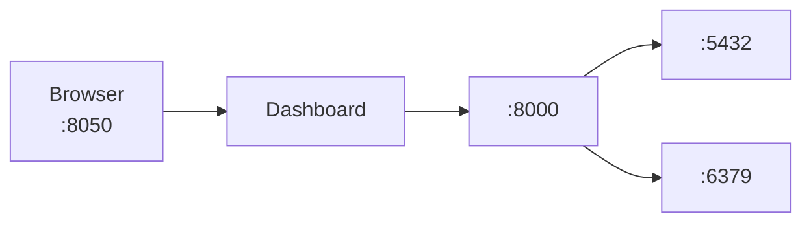

# Getting Started

Quick start guide for running CerberusRisk locally.

---

## Prerequisites

- **Docker** and **Docker Compose** installed
- **8GB RAM** minimum (for smooth operation)
- **Ports available**: 8000 (API), 8050 (Dashboard), 5432 (PostgreSQL), 6379 (Valkey)

---

## Quick Start

### 1. Clone the Repository

```bash
git clone https://github.com/your-org/cerberusrisk.git
cd cerberusrisk
```

### 2. Start Services

```bash
docker compose up -d
```

This starts all services:
- **PostgreSQL** - Database (port 5432)
- **Valkey** - Cache (port 6379)
- **API** - Backend (port 8000)
- **Dashboard** - Frontend (port 8050)

### 3. Access the Dashboard

Open your browser to: **http://localhost:8050**

---

## Architecture



---

## Environment Variables

Configuration is managed via environment variables in `compose.yml`:

| Variable | Default | Description |
|----------|---------|-------------|
| `POSTGRES_HOST` | postgres | Database host |
| `POSTGRES_PORT` | 5432 | Database port |
| `POSTGRES_DB` | cerberusrisk | Database name |
| `POSTGRES_USER` | cerberus | Database user |
| `POSTGRES_PASSWORD` | cerberus | Database password |
| `VALKEY_HOST` | valkey | Cache host |
| `VALKEY_PORT` | 6379 | Cache port |
| `API_URL` | http://api:8000 | Backend URL (internal) |
| `DEBUG` | true | Debug mode |

---

## Development Mode

For hot-reload during development:

```bash
docker compose -f compose.yml -f compose.override.yml up
```

This enables:
- **API**: Auto-reload on code changes
- **Dashboard**: Auto-reload on code changes
- **Volume mounts**: Local code synced to containers

---

## Sample Data

On first startup, the database is seeded with three sample portfolios:

### Global Equity Portfolio
| Ticker | Name | Weight |
|--------|------|--------|
| AAPL | Apple Inc | 15% |
| MSFT | Microsoft Corp | 12% |
| NVDA | NVIDIA Corp | 10% |
| AMZN | Amazon.com | 10% |
| JPM | JPMorgan Chase | 8% |
| JNJ | Johnson & Johnson | 8% |
| NESN | Nestlé | 7% |
| ASML | ASML Holding | 7% |
| NOVO | Novo Nordisk | 6% |
| MC | LVMH | 5% |
| CASH | Cash | 12% |

### Fixed Income Portfolio
| Ticker | Name | Weight |
|--------|------|--------|
| TLT | 20+ Year Treasury | 30% |
| IEF | 7-10 Year Treasury | 25% |
| LQD | Investment Grade Corp | 25% |
| HYG | High Yield Corp | 15% |
| AGG | Aggregate Bond | 5% |

### Multi-Asset Balanced
| Ticker | Name | Weight |
|--------|------|--------|
| SPY | S&P 500 | 35% |
| VGK | Europe ETF | 15% |
| VWO | Emerging Markets | 10% |
| TLT | Long Treasury | 20% |
| LQD | Corp Bonds | 10% |
| GLD | Gold | 5% |
| CASH | Cash | 5% |

---

## Common Tasks

### View Logs

```bash
# All services
docker compose logs -f

# Specific service
docker compose logs -f api
docker compose logs -f dashboard
```

### Restart Services

```bash
docker compose restart api
docker compose restart dashboard
```

### Stop Services

```bash
docker compose down
```

### Reset Database

```bash
docker compose down -v  # Removes volumes
docker compose up -d    # Fresh start
```

### Rebuild Images

```bash
docker compose build --no-cache
docker compose up -d
```

---

## API Documentation

When running in development mode, interactive API docs are available:

- **Swagger UI**: http://localhost:8000/docs
- **ReDoc**: http://localhost:8000/redoc

---

## Troubleshooting

### Dashboard Not Loading

1. Check API is running: `docker compose ps`
2. Check API health: `curl http://localhost:8000/api/portfolios`
3. Check logs: `docker compose logs api`

### Market Data Not Updating

1. Refresh cache: Click "Refresh Data" in dashboard
2. Check Valkey: `docker compose logs valkey`
3. Verify internet connectivity

### Database Connection Errors

1. Check PostgreSQL: `docker compose logs postgres`
2. Wait for health check: `docker compose ps` (should show "healthy")
3. Restart API: `docker compose restart api`

---

## Next Steps

1. **Explore Home Page** - View executive dashboard with KPIs
2. **Analyze a Portfolio** - Click into Portfolio Analytics
3. **Run Stress Tests** - See scenario impacts
4. **Check Compliance** - Review GIPS, ESG, guidelines
5. **Read Documentation** - Learn about risk metrics
