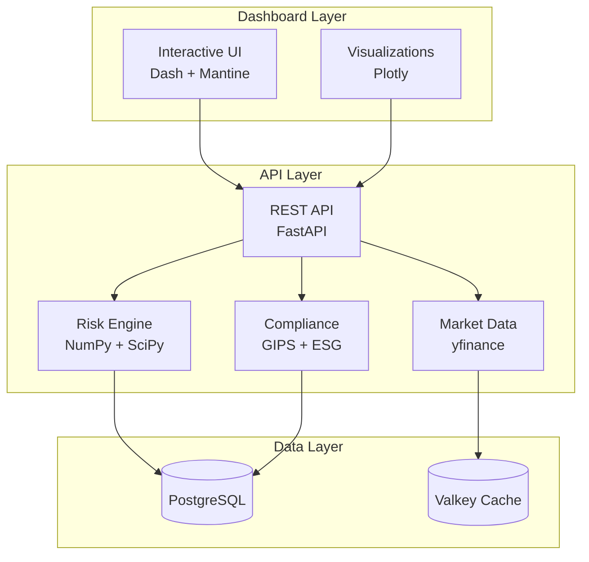
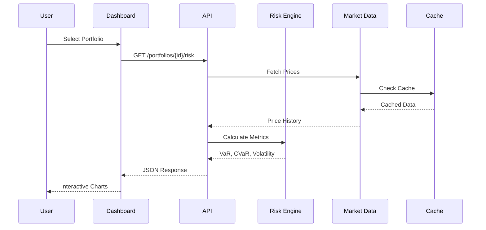

# CerberusRisk

**Enterprise Portfolio Risk Analytics Platform**

CerberusRisk provides institutional investors with comprehensive tools to analyze risk, monitor compliance, and understand portfolio performance through real-time market data and sophisticated quantitative models.

---

## Key Capabilities

### Risk Analytics
- **Value at Risk (VaR)** - 95% and 99% confidence levels
- **Conditional VaR (CVaR)** - Expected shortfall in tail scenarios
- **Volatility** - Annualized standard deviation
- **Drawdown Analysis** - Maximum and current drawdown tracking
- **Correlation Matrix** - Position-level correlation analysis

### Advanced Risk
- **Monte Carlo Simulation** - 10,000 path projections over 1-year horizon
- **Factor Exposures** - Market, size, and value beta decomposition
- **Rolling Metrics** - 20-day windows of key risk indicators
- **Tail Risk** - Skewness, kurtosis, worst/best day analysis
- **Liquidity Scoring** - Days-to-liquidate estimation

### Performance Attribution
- **Period Returns** - MTD, QTD, YTD, 1-year, annualized
- **Benchmark Comparison** - Active return, tracking error, information ratio
- **Risk-Adjusted Ratios** - Sharpe, Sortino, Treynor, Calmar
- **Position Attribution** - Contribution of each holding to total return

### Stress Testing
- **6 Macro Scenarios** - Equity crash, rate shocks, stagflation, risk-off
- **Asset-Class Shocks** - Equity, bonds, credit, commodities
- **P&L Impact** - Position-level and portfolio-level impact analysis

### Compliance Monitoring
- **GIPS** - Time-weighted returns, monthly periods, dispersion
- **ESG Scoring** - Environmental, Social, Governance weighted scores
- **Investment Guidelines** - Position limits, sector caps, liquidity floors

---

## Platform Architecture

---

## Data Flow

---

## Sample Portfolios

The platform includes three pre-configured portfolios for demonstration:

| Portfolio | Type | Positions | Description |
|-----------|------|-----------|-------------|
| Global Equity | Equity | 11 | US and European large-cap stocks |
| Fixed Income | Fixed Income | 5 | Government and corporate bond ETFs |
| Multi-Asset Balanced | Multi-Asset | 7 | Diversified equity, bonds, gold |

---

## Technology Stack

| Layer | Technology | Purpose |
|-------|------------|---------|
| Frontend | Dash + Mantine | Interactive UI components |
| Charts | Plotly | Data visualization |
| API | FastAPI | High-performance REST endpoints |
| Database | PostgreSQL | Persistent storage |
| Cache | Valkey | Market data caching |
| Quantitative | NumPy, SciPy | Risk calculations |
| Market Data | yfinance | Real-time quotes and history |

---

## Navigation

- **Home** - Executive dashboard with KPIs and alerts
- **Analytics** - Deep-dive portfolio analysis (7 tabs)
- **Docs** - Platform documentation

For detailed information, see the other documentation pages.
