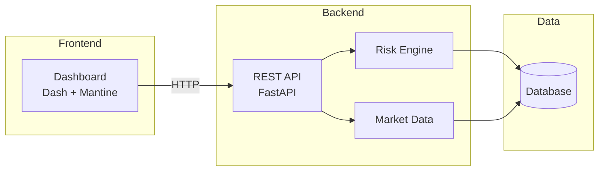
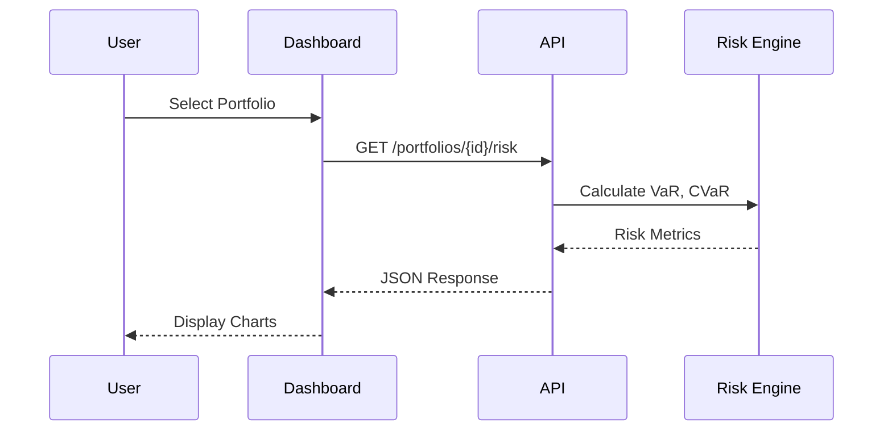

# CerberusRisk Documentation

Welcome to CerberusRisk, a portfolio risk analytics platform.

## Features

- **Portfolio Overview** - View all portfolios with key risk metrics
- **Risk Analytics** - VaR, CVaR, volatility, and Monte Carlo simulations
- **Stress Testing** - Scenario-based impact analysis
- **Compliance** - GIPS, ESG, and investment guidelines monitoring

## Getting Started

Navigate to the **Home** page to see your portfolios, or dive into **Portfolio Analytics** for detailed risk analysis.

## Architecture

## Data Flow

## Component Overview

| Component | Technology | Purpose |
|-----------|------------|---------|
| Dashboard | Dash + Mantine | Interactive UI |
| API | FastAPI | REST endpoints |
| Risk Engine | Python | Risk calculations |
| Charts | Plotly | Visualizations |
