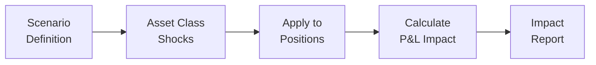
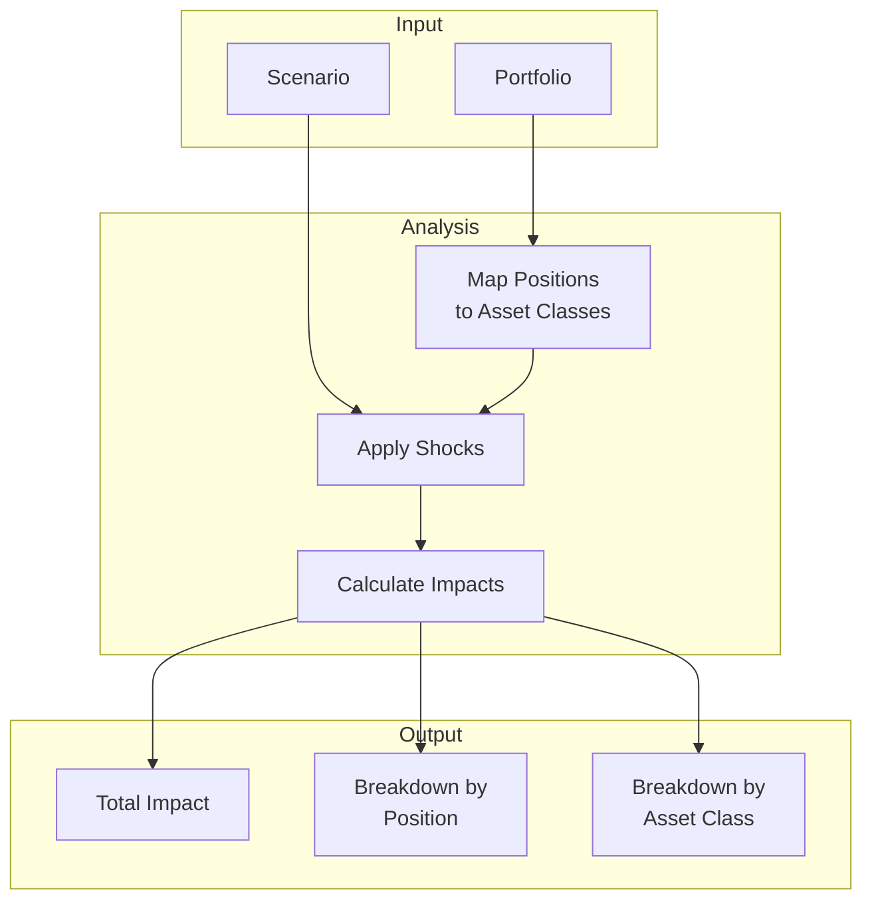

# Stress Testing

Scenario-based analysis to understand portfolio behavior under adverse market conditions.

---

## Overview

Stress testing applies hypothetical market shocks to portfolio positions to estimate potential losses under extreme but plausible scenarios.

---

## Available Scenarios

### 1. Equity Market Crash

Simulates a severe equity market decline similar to 2008 financial crisis or March 2020.

| Asset Class | Shock |
|-------------|-------|
| Equity | -20% |
| Government Bonds | +5% |
| Investment Grade Credit | -3% |
| High Yield Credit | -10% |

**Historical Reference**: S&P 500 fell 34% in March 2020 COVID crash.

---

### 2. Rate Shock Up

Models a sudden increase in interest rates, impacting bond prices negatively.

| Asset Class | Shock |
|-------------|-------|
| Government Bonds (Long) | -15% |
| Government Bonds (Short) | -5% |
| Investment Grade Credit | -10% |
| High Yield Credit | -8% |
| Equity | -5% |

**Historical Reference**: 2022 rate hike cycle saw 20-year Treasury bonds fall ~30%.

---

### 3. Rate Shock Down

Models a deflationary shock with rates falling (flight to safety).

| Asset Class | Shock |
|-------------|-------|
| Government Bonds (Long) | +10% |
| Government Bonds (Short) | +3% |
| Investment Grade Credit | +5% |
| Equity | -10% |

**Historical Reference**: 2019 rate cut cycle and COVID initial flight-to-quality.

---

### 4. Credit Spread Widening

Simulates credit market stress with spreads widening significantly.

| Asset Class | Shock |
|-------------|-------|
| Investment Grade Credit | -8% |
| High Yield Credit | -15% |
| Emerging Market Debt | -12% |
| Equity | -8% |
| Government Bonds | +3% |

**Historical Reference**: March 2020 saw IG spreads widen 200+ bps.

---

### 5. Stagflation

Models persistent inflation with economic stagnation - negative for both stocks and bonds.

| Asset Class | Shock |
|-------------|-------|
| Equity | -15% |
| Government Bonds | -12% |
| Investment Grade Credit | -10% |
| Real Assets | +5% |
| Commodities | +10% |
| Gold | +8% |

**Historical Reference**: 1970s stagflation saw S&P 500 decline 45% in real terms.

---

### 6. Risk-Off Event

Models a general risk aversion event with flight to safety.

| Asset Class | Shock |
|-------------|-------|
| Equity | -10% |
| High Yield Credit | -8% |
| Emerging Markets | -12% |
| Government Bonds | +5% |
| Gold | +5% |
| Cash | 0% |

**Historical Reference**: Typical geopolitical or banking crisis response.

---

## Impact Calculation

### Position-Level Impact

For each position, the impact is calculated as:

**Impact = Position Weight × Asset Class Shock**

### Portfolio-Level Impact

Total portfolio impact is the sum of all position impacts:

**Portfolio Impact = Σ (Position Weight × Position Shock)**

---

## Stress Test Report

### Sample Output

| Position | Asset Class | Weight | Shock | Contribution |
|----------|-------------|--------|-------|--------------|
| AAPL | Equity | 15% | -20% | -3.00% |
| MSFT | Equity | 12% | -20% | -2.40% |
| TLT | Govt Bond | 10% | +5% | +0.50% |
| **Total** | | | | **-4.90%** |

---

## Cross-Portfolio Comparison

Compare how different portfolios perform under the same scenario:

| Portfolio | Equity Crash | Rate Up | Stagflation |
|-----------|-------------|---------|-------------|
| Global Equity | -18.5% | -6.2% | -14.1% |
| Fixed Income | -2.1% | -12.8% | -10.5% |
| Multi-Asset | -10.3% | -7.5% | -8.2% |

---

## Use Cases

### Risk Budgeting

Understand which scenarios pose the greatest risk to your portfolio.

### Hedging Decisions

Identify positions that provide protection in stress scenarios.

### Client Reporting

Communicate downside risks to stakeholders with concrete numbers.

### Regulatory Compliance

Meet regulatory requirements for stress testing (e.g., Dodd-Frank, CCAR).

---

## Limitations

- **Historical Basis**: Shocks are based on historical events and may not capture unprecedented scenarios
- **Linear Approximation**: Assumes linear impact; actual drawdowns may be non-linear
- **Correlation Assumptions**: Does not model correlation breakdown in crisis
- **No Second-Order Effects**: Does not model contagion or feedback loops

---

## Best Practices

1. **Run Multiple Scenarios**: Don't rely on a single stress test
2. **Update Regularly**: Review and update scenarios as market conditions change
3. **Consider Tail Events**: Historical shocks may underestimate true tail risk
4. **Combine with VaR**: Use stress tests alongside VaR for complete risk picture
5. **Document Assumptions**: Clear documentation of methodology and limitations
